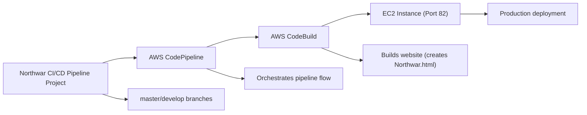
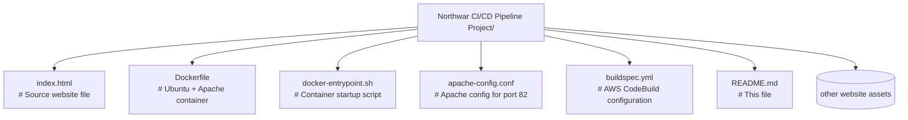

# Northwar CI/CD Pipeline Project

📋 Project Overview

A complete CI/CD pipeline that automatically builds and deploys a website to port 82 when changes are pushed to the master branch, while only building (no deployment) for the develop branch.

🎯 Project Requirements

✅ Git workflow implementation (master/develop branches)

✅ AWS CodeBuild triggers on commit to master or develop branches

✅ Master branch: Build + Publish website on port 82

✅ Develop branch: Build only (no publication)

✅ Complete CI/CD pipeline implementation

✅ Ubuntu + Apache container for building

✅ Website served from 'Northwar.html'

🏗️ Architecture

📁 Project Structure 

🚀 Quick Start

1. Fork and Clone the Repository

    Fork https://github.com/hshar/website to your GitHub account

    git clone https://github.com/YOUR_USERNAME/website.git
    
    cd website
    
    git checkout -b develop

2. Set Up Required Files

Add these files to your repository:

    Dockerfile (Ubuntu + Apache container)
    apache-config.conf (Apache port 82 config)
    buildspec.yml (CodeBuild configuration)
    docker-entrypoint.sh (Container entrypoint)

3. AWS Infrastructure Setup

IAM Roles:

    CodeBuildServiceRole with:
        AWSCodeBuildAdminAccess
        AmazonS3FullAccess
        AmazonEC2ContainerRegistryFullAccess

    CodePipelineServiceRole with:
        AWSCodePipelineFullAccess
        AmazonS3FullAccess
        Trust relationship: codepipeline.amazonaws.com

ECR Repository:

    Create and push Docker image
    aws ecr create-repository --repository-name ci-cd-build-image
    docker build -t ci-cd-build-image .
    docker push YOUR_ACCOUNT.dkr.ecr.REGION.amazonaws.com/ci-cd-build-image:latest

EC2 Instance:

    Ubuntu 22.04, t2.micro
    Security group: Open ports 22, 80, 82
    Apache configured to serve on port 82

4. AWS Services Configuration

CodeBuild Project:

    Name: Website-CI-Pipeline
    Source: GitHub (your repository)
    Environment: Custom ECR image ci-cd-build-image:latest
    Service role: CodeBuildServiceRole
    Privileged: ✅ Yes

CodePipeline:

    Name: Website-CI-CD-Pipeline
    Source: GitHub (master branch)
    Build: AWS CodeBuild (Website-CI-Pipeline)
    Artifact store: S3 bucket

⚙️ Configuration Files

Dockerfile:

    FROM ubuntu:22.04
    ENV DEBIAN_FRONTEND=noninteractive
    RUN apt-get update && apt-get install -y apache2 git curl awscli
    RUN echo "Listen 82" >> /etc/apache2/ports.conf
    WORKDIR /build
    CMD ["/bin/bash"]

buildspec.yml
    version: 0.2
    phases:
    pre_build:
        commands:
        - cp index.html Northwar.html
    post_build:
        commands:
        - |
            if echo "$CODEBUILD_WEBHOOK_TRIGGER" | grep -q "master"; then
            echo "DEPLOYING to port 82"
            # Deployment commands here
            else
            echo "BUILD ONLY (No deploy)"
            fi
    artifacts:
    files:
        - Northwar.html

🔧 Branch Behavior

|Branch | Trigger | Action | Result                                    |
|-------|---------|--------|-------------------------------------------|
|master	|Push commit | Build + Deploy | Website published on port 82   |
|develop |	Push commit | Build only | Artifacts created, no deployment|
|Other | Push commit | Build only | Artifacts created, no deployment   |

🧪 Testing the Pipeline

Test Develop Branch:

    git checkout develop
    echo "<!-- Develop test -->" >> index.html
    git add . && git commit -m "Test develop" && git push origin develop
    # Result: Build runs, no deployment

Test Master Branch:

    git checkout main
    git merge develop
    echo "<!-- Master test -->" >> index.html
    git add . && git commit -m "Test master" && git push origin main
    # Result: Build runs + deploys to EC2 port 82

📊 Monitoring

AWS Console Locations:

    1. CodePipeline: View pipeline execution status
    2. CodeBuild: Check build logs and artifacts
    3. CloudWatch: Detailed logs for troubleshooting
    4. EC2: Verify Apache service on port 82
    5. S3: Review build artifacts

Verify Deployment:

    # Test website on port 82
    curl http://EC2_PUBLIC_IP:82/Northwar.html

🚨 Troubleshooting

| Issue	| Solution |
|-------|----------|
|Pipeline not triggering | Check GitHub webhook in CodePipeline settings|
|CodeBuild fails | Verify ECR permissions in IAM role|
|EC2 not accessible | Check security group allows port 82|
|Apache not on port 82 | Verify /etc/apache2/ports.conf has Listen 82|
|Branch detection fails | Check $CODEBUILD_WEBHOOK_TRIGGER in buildspec|

💰 Cost Optimization

    * Use t2.micro instances (free tier eligible)
    * Configure S3 lifecycle policies for artifacts
    * Use CloudWatch alarms for budget monitoring
    * Schedule non-production resources to stop overnight

📝 Key Features

    * Automated Builds: Triggered on every commit
    * Branch-Specific Logic: Different behavior for master/develop
    * Containerized Builds: Consistent build environment
    * Port 82 Deployment: Unique port for production website
    * Infrastructure as Code: All configurations in version control

🔗 Useful Links

    * AWS CodeBuild Documentation
    * AWS CodePipeline Documentation
    * GitHub Repository
    * Source Website

👥 Contributing

    1. Fork the repository
    2. Create a feature branch (git checkout -b feature/AmazingFeature)
    3. Commit changes (git commit -m 'Add AmazingFeature')
    4. Push to branch (git push origin feature/AmazingFeature)
    5. Open a Pull Request to develop branch

📄 License

This project is for educational purposes as part of a CI/CD pipeline implementation task.

🆘 Support

For issues with this implementation:
    
    1. Check the troubleshooting section
    2. Verify AWS service configurations
    3. Review CloudWatch logs for error details
    4. Ensure all IAM permissions are correctly set